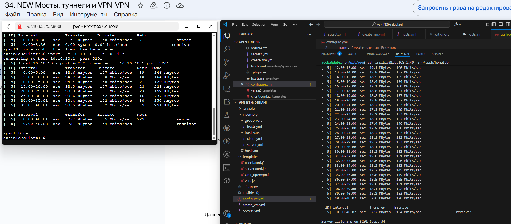

##35. Мосты, туннели и VPN 

### Задание
Что нужно сделать?

1)Настроить VPN между двумя ВМ в tun/tap режимах, замерить скорость в туннелях, сделать вывод об отличающихся показателях

2)Поднять RAS на базе OpenVPN с клиентскими сертификатами, подключиться с локальной машины на ВМ

Задание со звездочкой

3)Самостоятельно изучить и настроить ocserv, подключиться с хоста к ВМ
Формат сдачи ДЗ - vagrant + ansible


### Решение


#### Развертывание Openvpn сервера и клиента 

Перед выполнениене необходимо  собрать свой файл secrets.yml в котором будут содержаться  ваши  данные для авторизации в вашекй виртуализации Proxmox

```bash
ansible-playbook create_vm.yml --ask-vault-pass
```
При выполнении данной команды у вас равзвернется 2 виртуальные машины в виртуализации Proxmox:-

-server - 2 сетевых интерфейса - 192.168.1.40 и 192.168.56.10

-client - 2 сетевых интерфейса - 192.168.1.41 и 192.168.56.20

После выполним 

```bash
ansible-playbook configure.yml --ask-vault-pass 

```


Который в свою очередь выполнит следующие действия:

1) Установка компанентов -  
     - openvpn
     - iperf3
     - git

2) Скопирует Юнит лдля работы сервиса
3) Выпаолнит настройку easy-rsa 
4) Создаст сертификаты для сервера и клиента
5) Скопирует файлы конфигурации для сервера и клиента
6) Запустит сервисы на клиенте и сервере

При дейфолтной настройке у неас произодет настройка конфигурации в режиме tap для  режима tun необходимо выполнить следущие действия:
```bash
sudo nano /etc/openvpn.conf
# В файе необходимо изменить строчку 
# "dev tap" на "dev tun" на клиентском пк и сервере
После произаести перзапуск сервиса 
```
Измерения при tap


Измерения при tun


Описание TUN и TAP

OpenVPN следует использовать в режиме TUN (сетевой туннель), который передает IP-пакеты и работает на сетевом уровне (уровень 3 OSI), в большинстве случаев, так как это обеспечивает маршрутизацию и более эффективен для VPN. Режим TAP (сетевой TAP) используется для создания мостового соединения (сетевой мост), передает кадры Ethernet и работает на канальном уровне (уровень 2 OSI), что необходимо, если вам нужен доступ к устройствам в локальной сети через VPN-туннель. 
Когда использовать TUN:
Стандартное использование VPN: Это самый распространенный вариант для VPN-соединений, где нужно получить доступ к ресурсам удаленной сети путем маршрутизации IP-пакетов. 
Простая маршрутизация: Если вам не нужно, чтобы удаленные клиенты были "видны" как устройства в локальной сети, а просто требовался доступ к IP-адресам, TUN подходит лучше. 
Когда использовать TAP:
Создание моста: TAP используется, когда необходимо объединить локальную сеть сервера и сеть клиента, создав единый виртуальный мост. 
Поддержка разных протоколов: Если клиентам требуется доступ к устройствам, работающим на канальном уровне (например, принтеры, некоторые сетевые хранилища), или если требуется поддержка других сетевых протоколов помимо IP, TAP будет лучшим выбором. 
Сценарии для прозрачного доступа: В этом режиме удаленные клиенты воспринимаются как часть локальной сети. 